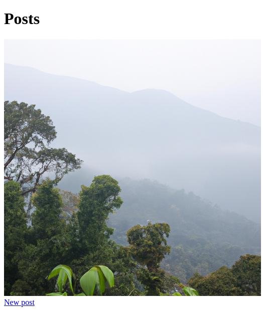

# RailsAiTag

```erb
<%= ai_image_tag("A cute cat with a barretina that likes ruby on rails") %>
```


RailsAiTag is a Ruby on Rails gem that provides custom HTML helpers for AI-powered image generation. Currently, it supports generating `` tags with images created by OpenAI's image generation API, based on a given description. This gem is designed to be extendable, with plans for supporting other AI services.

## Installation

Add this line to your Rails application's Gemfile:

```ruby
gem 'rails_ai_tag'
```
Then, run:

```bash
bundle install
```

## Configuration

Configure the gem by specifying your AI service provider and API key. Currently, only OpenAI is supported as the provider.

Add the configuration in an initializer (e.g., config/initializers/rails_ai_tag.rb):

```ruby
RailsAiTag.configure do |config|
  config.provider = :openai        # Currently, only :openai is supported
  config.api_key = "YOUR_OPENAI_API_KEY"  # Replace with your actual OpenAI API key
end
```

## Usage
Use the ai_image_tag helper in your Rails views. 

Provide a description, and the helper will generate an image based on the description using OpenAI's API.

```erb
<%= ai_image_tag("A futuristic cityscape at sunset") %>
```

This helper method generates an  tag with the AI-generated image URL and sets the alt attribute to the description.


## Example
```erb
<%= ai_image_tag("A lush green forest with misty mountains in the background") %>
```

The above code will generate an image tag for an AI-generated image that matches the description provided.

## Testing
RailsAiTag uses RSpec and WebMock for testing. You can run the tests with:

```bash
rspec
```